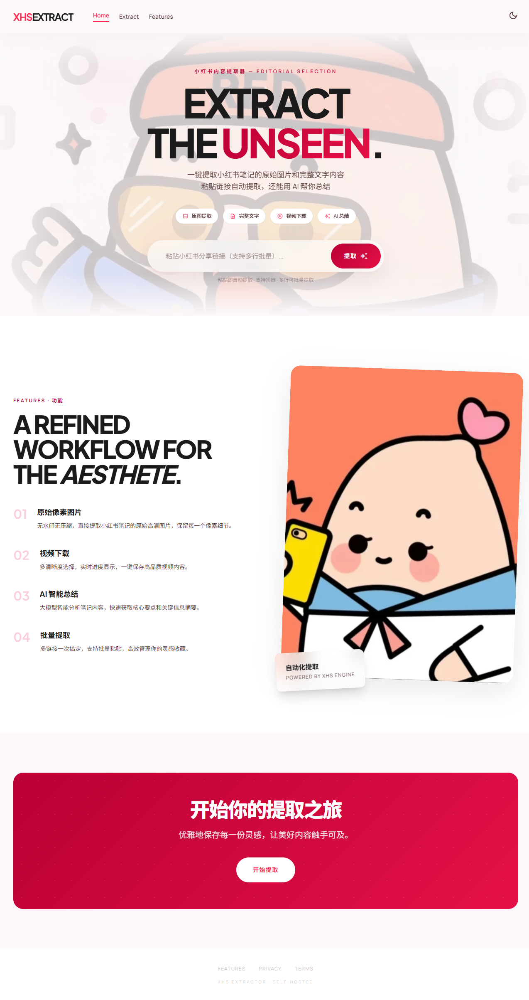

<div align="center">

# XHS Extract

**从小红书笔记中提取原始画质图片、完整文案与 AI 内容分析**

一个自部署的内容提取工具，绕过平台水印与防盗链，拿到你真正需要的东西。

[快速开始](#快速开始) · [功能](#功能一览) · [部署](#docker-部署) · [配置](#环境变量)

</div>

---



---

## 为什么做这个

小红书的图片默认带水印、经过压缩，分享出来的链接也不方便直接获取内容。现有的第三方工具要么充满广告，要么需要上传到不可信的服务器。

这个项目让你用一条命令在本地跑起来，粘贴链接就能拿到：无水印原图、完整文案、热门评论，还能用 AI 做内容摘要。数据不经过任何第三方。

## 功能一览

- **无水印原图** — 直接从 XHS CDN 拉取 `fileId` 对应的原始文件，跳过平台水印和压缩
- **完整文案提取** — 标题、正文、话题标签、互动数据、热门评论，一次拿全
- **视频提取** — 支持多清晰度选择，播放器内直接切换画质
- **批量处理** — 一次粘贴多个链接，并行提取
- **AI 摘要** — 接入 Grok / OpenAI / Claude，一键生成内容分析
- **ZIP 打包下载** — 图片一键打包，带下载进度条
- **暗色模式** — 跟随系统或手动切换
- **移动端适配** — 图片灯箱支持左右滑动浏览

## 快速开始

```bash
git clone https://github.com/Evan715823/xhs-extractor.git
cd xhs-extractor
pip install -r requirements.txt
cp .env.example .env   # 编辑 .env，填入 LLM_API_KEY
python app.py
```

浏览器打开 `http://localhost:5000`，粘贴小红书链接即可。

> AI 摘要功能需要配置 `LLM_API_KEY`，图片/视频提取不需要。

## Docker 部署

```bash
docker compose up -d
```

生产环境自动使用 gunicorn（2 worker + 4 线程），内置健康检查。

## 云端部署（Render）

1. Fork 本仓库到你的 GitHub
2. 打开 [render.com](https://render.com)，New → Web Service，连接仓库
3. Render 会自动识别 `render.yaml` 配置
4. 在 Environment 中添加 `LLM_API_KEY`
5. Deploy，等待构建完成即可访问

## 环境变量

| 变量 | 说明 | 默认值 |
|------|------|--------|
| `LLM_API_KEY` | AI 摘要所需的 API Key | — |
| `LLM_PROVIDER` | `grok` / `openai` / `anthropic` | `grok` |
| `LLM_MODEL` | 模型名称 | `grok-3` |
| `LLM_BASE_URL` | 自定义 API 地址（兼容 OpenAI 格式的都行） | — |
| `XHS_COOKIE` | 小红书登录 Cookie（访问需登录的笔记时需要） | — |
| `FLASK_DEBUG` | 开发模式热重载 | `false` |

<details>
<summary><b>如何获取小红书 Cookie</b></summary>

1. 浏览器打开 xiaohongshu.com 并登录
2. F12 → Application → Cookies → xiaohongshu.com
3. 复制所有 Cookie 值填入 `.env` 的 `XHS_COOKIE`

> 大部分公开笔记不需要 Cookie，仅在提取需要登录才能查看的内容时使用。

</details>

## 技术栈

```
Flask + httpx + BeautifulSoup     后端，无数据库，完全无状态
Tailwind CSS + Vanilla JS         前端，无构建步骤
gunicorn                          生产部署
```

## 项目结构

```
├── app.py              Flask 路由与 API 端点
├── scraper.py           核心抓取逻辑、图片/视频代理
├── llm_service.py       LLM 调用封装（Grok/OpenAI/Claude）
├── static/
│   ├── app.js           前端交互逻辑
│   └── style.css        自定义样式
├── templates/
│   └── index.html       单页应用模板
├── Dockerfile
└── docker-compose.yml
```

## 许可

MIT
